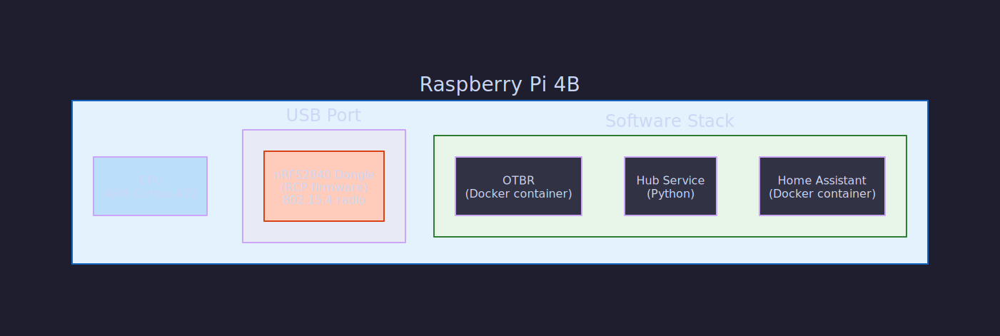
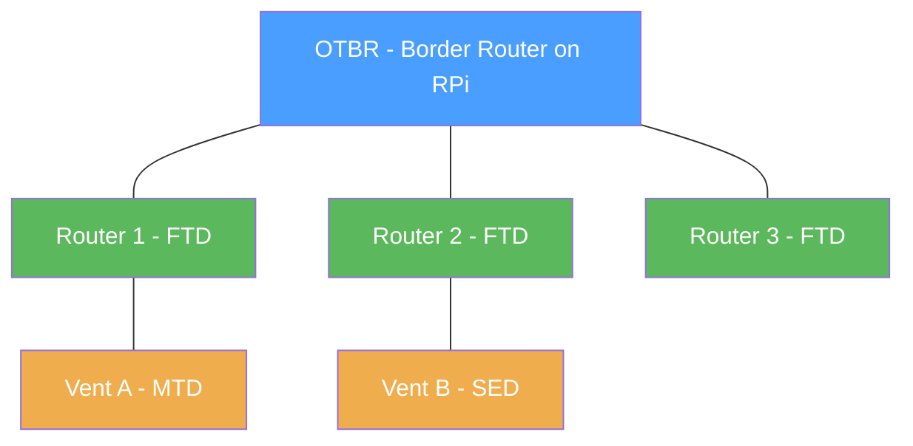
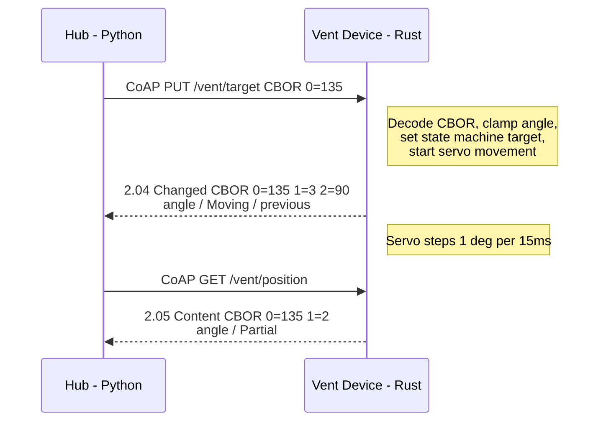
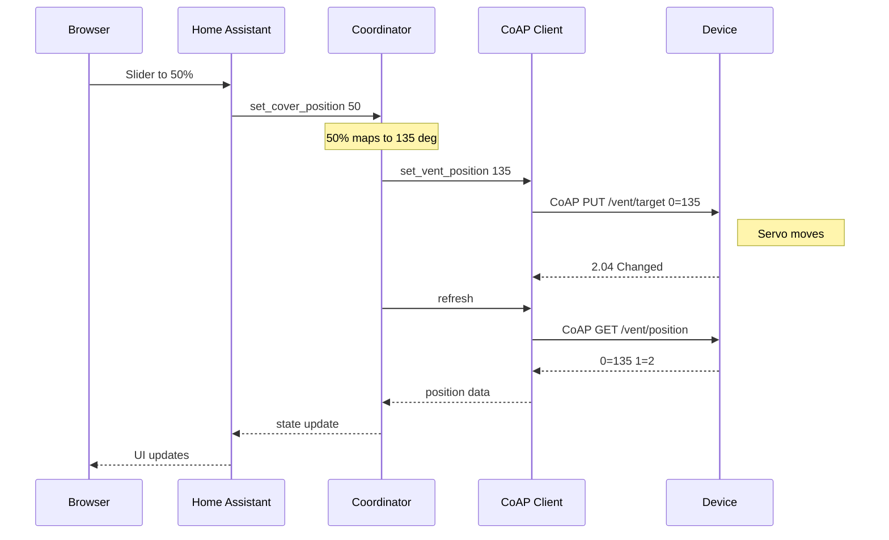
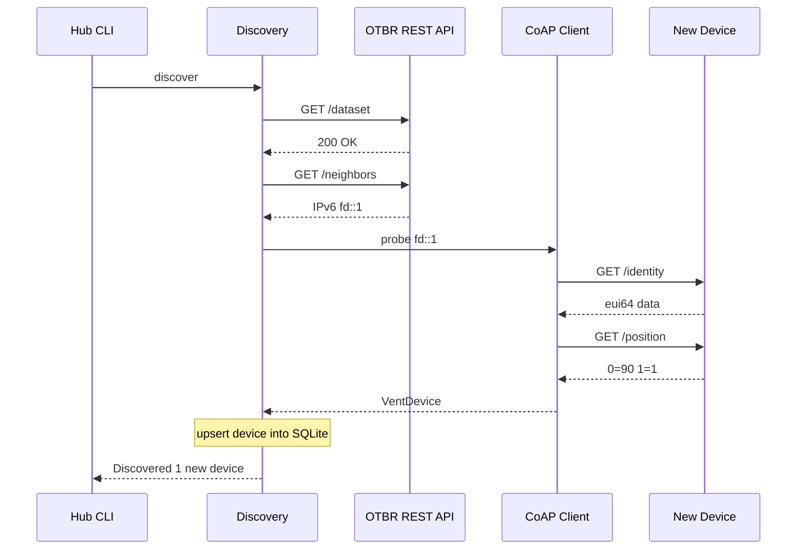
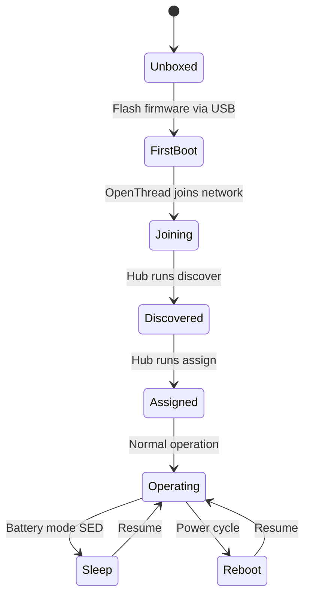
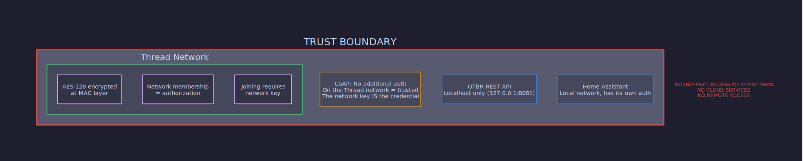

# Architecture

Comprehensive architecture reference for the Smart Vent Control System. Covers every layer from physical hardware to the Home Assistant dashboard, how data flows between them, and what every acronym and technology means.

---

## Table of Contents

1. [System Overview](#1-system-overview)
2. [Physical Layer](#2-physical-layer)
3. [Network Layer](#3-network-layer)
4. [Application Layer](#4-application-layer)
5. [Software Components](#5-software-components)
6. [Data Flow](#6-data-flow)
7. [Device Lifecycle](#7-device-lifecycle)
8. [Power Architecture](#8-power-architecture)
9. [Security Model](#9-security-model)
10. [Testing Architecture](#10-testing-architecture)
11. [Glossary](#11-glossary)

---

## 1. System Overview

The system controls HVAC register vents (the grilles in your floor/wall/ceiling) by attaching a small servo motor to each vent's damper. A microcontroller at each vent communicates wirelessly to a central hub, which exposes everything to Home Assistant for dashboards, automations, and voice control.


**No cloud services are used.** All communication stays within the local network. The Thread mesh does not require — and should not have — internet access.

---

## 2. Physical Layer

### 2.1 Vent Controller Node

Each HVAC vent gets one controller node consisting of:


| Component | Part | Purpose |
|-----------|------|---------|
| MCU | ESP32-C6 | Main processor, runs firmware, has built-in 802.15.4 radio |
| Servo | SG90 | Physically opens/closes the vent damper |
| Radio | Built into ESP32-C6 | IEEE 802.15.4 for Thread mesh networking |
| Flash | Built into ESP32-C6 | NVS partition stores configuration persistently |
| eFuse | Built into ESP32-C6 | One-time-programmable memory holding unique MAC/EUI-64 |

### 2.2 Hub



The nRF52840 dongle acts purely as a **Radio Co-Processor (RCP)** — it does no application processing. It forwards raw 802.15.4 radio frames to the OTBR software running on the Pi, which handles all Thread protocol logic.

---

## 3. Network Layer

### 3.1 Protocol Stack


Each layer explained:

| Layer | Protocol | Why |
|-------|----------|-----|
| Physical | 2.4 GHz ISM band | License-free, global availability, built into ESP32-C6 |
| MAC | IEEE 802.15.4 | Low-power, low-data-rate wireless — designed for sensor networks |
| Adaptation | 6LoWPAN | Compresses IPv6 headers to fit in small 802.15.4 frames (127 bytes max) |
| Network | IPv6 | Every device gets a routable address; no NAT, no address translation |
| Mesh | Thread | Self-healing mesh routing, devices relay for each other |
| Transport | UDP | Connectionless, low overhead (no TCP handshake) |
| Application | CoAP | REST-like (GET/PUT) designed for constrained devices, runs over UDP |
| Encoding | CBOR | Binary JSON — smaller and faster to parse than text JSON |

### 3.2 Thread Mesh Topology



- **Blue:** Border Router — bridges Thread mesh to local IP network
- **Green:** Full Thread Devices (FTD) — can relay messages for other devices
- **Orange:** Minimal/Sleepy End Devices (MTD/SED) — only talk to their parent router

**Our vent devices are MTDs (or SEDs when battery-powered).** They don't relay messages for other devices — they only talk to their parent router. This saves power at the cost of not contributing to mesh routing.

### 3.3 Addressing

Every device on the Thread mesh gets several IPv6 addresses:

| Address Type | Example | Use |
|-------------|---------|-----|
| Mesh-Local EID | `fd00::1234:5678:abcd:ef01` | Stable address within the mesh, used for CoAP |
| RLOC | `fd00::ff:fe00:1800` | Changes with mesh topology; used by Thread internals |
| Link-Local | `fe80::a8bb:ccff:fedd:eeff` | Single radio hop only; used for neighbor discovery |
| Multicast | `ff03::1` | Realm-local all-nodes; used for broadcast commands |

The hub communicates with devices using their **Mesh-Local EID** — the stable address that doesn't change as the mesh rearranges.

---

## 4. Application Layer

### 4.1 CoAP Resource Tree

Each vent device exposes this resource tree on port 5683:

```
coap://[device-ipv6]:5683/
├── vent/
│   ├── position    GET         → current angle + state
│   └── target      PUT         → set desired angle
└── device/
    ├── identity    GET         → EUI-64, firmware version, uptime
    ├── config      GET | PUT   → room, floor, name assignment
    └── health      GET         → RSSI, power source, free heap
```

### 4.2 CBOR Encoding

All payloads use CBOR (Concise Binary Object Representation) with **integer keys** for compactness. This is critical because 802.15.4 frames max out at 127 bytes.

```
JSON (human-readable, 44 bytes):
{"angle": 135, "state": "partial"}

CBOR with integer keys (compact, ~10 bytes):
{0: 135, 1: 2}
     ↑       ↑
   key 0   key 1 = VentState::Partial (index 2)
```

The integer-to-field mapping is defined in `firmware/shared-protocol/src/lib.rs` using minicbor derive macros (`#[n(0)]`, `#[n(1)]`, etc.) and mirrored in the Python hub's client code.

### 4.3 Request/Response Flow



---

## 5. Software Components

### 5.1 Firmware (Rust, ESP32-C6)

```
firmware/vent-controller/src/
│
├── main.rs         Startup, peripheral init, main loop
│                   Orchestrates all other modules
│
├── servo.rs        LEDC PWM driver for SG90 servo
│                   angle_to_duty() converts 0-180° to pulse width
│                   50 Hz PWM signal, 500-2500μs pulse range
│
├── state.rs        Vent state machine
│                   States: Open, Closed, Partial, Moving
│                   step() advances 1° toward target per call
│                   Testable on host (no hardware deps)
│
├── identity.rs     Device identity via eFuse + NVS
│                   Reads permanent EUI-64 from eFuse
│                   Stores room/floor/name/angle in NVS
│
├── thread.rs       OpenThread network stack
│                   Inits 802.15.4 radio, joins as MTD
│                   Manages IPv6 addressing
│
├── coap.rs         CoAP server and resource handlers
│                   5 endpoints (position, target, identity, config, health)
│                   CBOR encode/decode via minicbor
│
└── power.rs        Power management
                    Deep sleep with timer wake
                    SED poll period configuration

firmware/shared-protocol/src/
└── lib.rs          CBOR message types shared between crates
                    VentPosition, TargetRequest, DeviceConfig, etc.
                    minicbor Encode/Decode derive macros
```

Built with the **esp-rs** ecosystem: `esp-idf-hal` (hardware abstraction), `esp-idf-svc` (ESP-IDF services), `esp-idf-sys` (raw FFI bindings to ESP-IDF C SDK).

### 5.2 Hub Service (Python)

```
hub/src/vent_hub/
│
├── models.py           Data models: VentDevice, Room, Floor
│                       VentState and PowerSource enums
│                       Angle ↔ percentage conversion
│
├── coap_client.py      Async CoAP client (aiocoap)
│                       GET/PUT with CBOR encode/decode
│                       probe_device() for full device query
│
├── device_registry.py  SQLite database for device inventory
│                       CRUD operations, query by room/floor
│                       Upsert preserves existing assignments
│
├── group_manager.py    Batch operations on device groups
│                       set_room_angle(), set_floor_angle()
│                       Concurrent CoAP calls with error handling
│
├── discovery.py        OTBR REST API integration
│                       Queries neighbor table for Thread addresses
│                       Probes each address via CoAP
│                       Registers new devices automatically
│
├── scheduler.py        Time-based automation rules
│                       ScheduleRule with time/target/angle
│                       Runs checks every 60 seconds
│
├── config.py           YAML configuration management
│                       OTBR URL, DB path, poll intervals
│
└── cli.py              Click CLI tool
                        Commands: discover, list, get, set,
                        set-room, set-floor, assign
```

### 5.3 Home Assistant Component

```
homeassistant/custom_components/vent_control/
│
├── __init__.py     Integration entry point
│                   Sets up coordinator, forwards to cover platform
│
├── manifest.json   HA integration metadata
│                   Declares dependencies (aiocoap, cbor2)
│
├── const.py        Constants (domain name, defaults, angle range)
│
├── config_flow.py  UI-based setup wizard
│                   User enters hub host/port/poll interval
│
├── coordinator.py  DataUpdateCoordinator subclass
│                   Polls all devices via CoAP on interval
│                   Caches state for entity consumption
│
├── cover.py        Cover entity implementation
│                   Maps vent angle (90-180°) to position (0-100%)
│                   Supports open, close, set_position
│                   Shows room/floor/firmware in extra attributes
│
└── strings.json    UI text for config flow
```

### 5.4 Simulator

```
tools/simulator/src/vent_simulator/
│
├── virtual_vent.py   Single simulated vent device
│                     In-memory state (angle, room, config)
│                     Builds full aiocoap resource tree
│                     5 resource classes matching firmware CoAP API
│
├── simulator.py      Multi-device manager
│                     Creates N virtual vents on consecutive ports
│                     Each vent gets its own CoAP server context
│
└── cli.py            CLI: vent-sim start --count 5
                      Pre-assigns rooms/floors for realism
```

---

## 6. Data Flow

### 6.1 User Sets Vent to 50% via HA Dashboard



### 6.2 Device Discovery



---

## 7. Device Lifecycle



| State | What Happens |
|-------|-------------|
| **Unboxed** | Fresh ESP32-C6, no firmware |
| **First Boot** | NVS empty, eFuse has EUI-64. Writes "initialized" flag. Defaults: angle=90 deg (closed), no room/floor |
| **Joining** | Attaches to Thread network, gets IPv6 mesh-local address, starts CoAP server on port 5683 |
| **Discovered** | Hub probes via CoAP, gets EUI-64, adds to SQLite registry. No room/floor assigned yet |
| **Assigned** | Room/floor stored in device NVS + hub DB. Appears in HA with area suggestion |
| **Operating** | Responds to CoAP commands, servo moves to commanded angles, position persisted to NVS, hub polls periodically |
| **Sleep** | Deep sleep (SED mode). Wakes on poll timer, checks for queued messages, returns to Operating |
| **Reboot** | Reads last angle from NVS, re-joins Thread, returns to Operating |

---

## 8. Power Architecture

### 8.1 USB-Powered Mode (Always-On)

```
USB-C 5V ──┬── ESP32-C6 (always running)
            └── SG90 servo (moves on command, idles otherwise)

Thread role: MTD (Minimal Thread Device)
  - Always listening for CoAP requests
  - Instant response time
  - No sleep cycles
  - ~150mA typical draw
```

### 8.2 Battery-Powered Mode (SED)

```
3×AA (4.5V) ──┬── ESP32-C6 (deep sleeps between polls)
               └── SG90 servo (moves on command)

Thread role: SED (Sleepy End Device)
  - Wakes every N ms (default: 5000ms) to check for queued messages
  - Parent router holds messages until device wakes
  - Response latency = up to 1 poll period
  - Deep sleep current: ~7μA
  - Active current: ~150mA (brief)

Timeline:
  sleep──────────┐  wake  ┌──sleep──────────┐  wake  ┌──sleep
                 │  (poll)│                  │  (poll)│
                 └────────┘                  └────────┘
                  ~50ms active              ~50ms active
                  5000ms sleep              5000ms sleep
```

### 8.3 NVS Persistence

When entering deep sleep, the ESP32-C6's main RAM is powered off. Critical state is saved to NVS (flash) before sleeping:

| Data | NVS Key | Survives |
|------|---------|----------|
| Last committed angle (checkpoint) | `angle` | Reboot + deep sleep |
| Pending target (write-ahead) | `target` | Reboot + deep sleep |
| WAL commit flag | `wal` | Reboot + deep sleep |
| Room/floor/name | `room`, `floor`, `name` | Reboot + deep sleep |
| Thread credentials | (managed by OpenThread) | Reboot + deep sleep |
| EUI-64 | eFuse (not NVS) | Everything (permanent) |
| Power mode config | NVS flash | Reboot + deep sleep |

### 8.4 Write-Ahead Log (WAL) Recovery

The servo takes time to physically move (1 degree per 15ms, so a full 90-degree sweep takes ~1.35 seconds). If power is lost mid-move, the device must recover to a consistent state on reboot. A write-ahead log pattern ensures no command is silently lost.

**The problem without WAL:** The device saves the vent angle to NVS only after a move completes. If power dies mid-move, the saved angle is stale (the position before the move started). On reboot the servo snaps back to that stale position and the in-flight command is lost — the hub thinks the vent moved, but it didn't.

**WAL protocol:**

```
1. WRITE-AHEAD    Command received → persist target + clear commit flag
                  NVS: target=150, wal=0

2. EXECUTE        Servo steps toward target (1 deg/15ms)
                  RAM only — NVS not touched during movement

3. COMMIT         Servo reaches target → persist final angle + set commit flag
                  NVS: angle=150, wal=1
```

**Recovery on boot:**

```
Read NVS "wal" flag
  │
  ├── wal=1 (committed)
  │   Normal boot. Restore "angle" as checkpoint.
  │   Servo drives to checkpoint position.
  │
  └── wal=0 (uncommitted)
      Previous move was interrupted.
      1. Restore "angle" (last checkpoint — known-good position)
      2. Read "target" (the write-ahead intent)
      3. Drive servo to checkpoint first
      4. Replay: set_target(pending) to complete the interrupted move
      5. When move completes → commit as usual
```

**Scenarios:**

| NVS State | What Happened | Boot Behavior |
|-----------|--------------|---------------|
| `wal=1, angle=150` | Move completed normally | Restore to 150 deg |
| `wal=0, angle=90, target=150` | Power lost mid-move | Restore to 90 deg, then replay move to 150 deg |
| No WAL keys | First boot ever | Default to 90 deg (closed) |

**Why restore-then-replay instead of jumping straight to the target?** The SG90 servo is absolute-position — it moves to whatever angle the PWM signal commands, regardless of where the shaft physically is. After a power loss the shaft could be anywhere between checkpoint and target. Driving to the checkpoint first establishes a known starting point, then replaying the move produces the same gradual 1-degree steps the original command intended. This avoids a sudden full-speed snap that could stress the damper linkage.

**NVS write ordering matters.** In `write_ahead()`, the target is written before the commit flag is cleared. If power dies between the two writes, the worst case is `wal=1` with a stale target — which is treated as "committed" and the stale target is harmlessly ignored. The reverse order would risk `wal=0` with no valid target, which would be harder to recover from.

---

## 9. Security Model



| Threat | Mitigation |
|--------|-----------|
| Eavesdropping on radio | Thread AES-128 encryption on every frame |
| Rogue device joining network | Requires Thread network key (shared during commissioning) |
| CoAP command injection | Attacker must be on Thread network (need the key) |
| Physical access to device | Device has no sensitive data beyond vent config |
| Internet-based attacks | Thread mesh has no internet route |

**Future enhancement:** DTLS (Datagram TLS) can be layered on top of CoAP if per-device authentication is ever needed.

---

## 10. Testing Architecture


---

## 11. Glossary

### Hardware

| Term | Full Name | What It Is |
|------|-----------|-----------|
| **ESP32-C6** | Espressif ESP32-C6 | A microcontroller with built-in WiFi, Bluetooth LE, and IEEE 802.15.4 radio. Uses a RISC-V CPU at 160 MHz. This is the brain inside each vent controller. |
| **SG90** | — | A small, cheap hobby servo motor. Rotates a shaft to a specific angle (0-180°) based on a PWM signal. We use the 90°-180° range to open/close vent dampers. |
| **nRF52840** | Nordic nRF52840 | A microcontroller from Nordic Semiconductor with an 802.15.4 radio. Used here as a USB dongle plugged into the Raspberry Pi, running Radio Co-Processor firmware to give the Pi access to the Thread mesh. |
| **RPi 4B** | Raspberry Pi 4B | A single-board computer (ARM, Linux) acting as the hub. Runs Home Assistant, OTBR, and the hub service. |

### Networking Protocols

| Term | Full Name | What It Is |
|------|-----------|-----------|
| **Thread** | Thread (protocol) | A mesh networking protocol for IoT devices. Built on top of IEEE 802.15.4 radio. Devices form a self-healing mesh where messages can hop through intermediate nodes to reach their destination. Provides IPv6 addressing, AES-128 encryption, and low-power operation. Developed by the Thread Group (Google, Apple, etc.). |
| **IEEE 802.15.4** | — | A radio standard for low-rate wireless personal area networks (LR-WPAN). Operates at 2.4 GHz with ~250 kbps data rate and low power consumption. Thread, Zigbee, and Matter all build on top of it. Think of it as the "WiFi" for tiny sensors — same frequency band, much lower power and speed. |
| **IPv6** | Internet Protocol version 6 | The next-generation internet protocol with 128-bit addresses (vs IPv4's 32-bit). Thread uses IPv6 natively, giving every device its own globally unique address without NAT. Addresses look like `fd00::1234:5678:abcd:ef01`. |
| **6LoWPAN** | IPv6 over Low-Power Wireless Personal Area Networks | An adaptation layer that compresses IPv6 headers to fit within the tiny 127-byte frames of 802.15.4. Without it, a single IPv6 header (40 bytes) would consume nearly a third of the frame. |
| **CoAP** | Constrained Application Protocol (RFC 7252) | A lightweight protocol for constrained devices, similar to HTTP but over UDP. Supports GET, PUT, POST, DELETE methods with small binary headers. Response codes mirror HTTP (2.05 Content ≈ 200 OK, 4.04 Not Found). Designed for devices with kilobytes of RAM. |
| **CBOR** | Concise Binary Object Representation (RFC 8949) | A binary data serialization format. Like JSON but binary — more compact and faster to parse. A JSON object `{"angle": 135}` is 16 bytes; in CBOR with integer keys, it's ~4 bytes. Critical for fitting data in 802.15.4 frames. |
| **UDP** | User Datagram Protocol | A connectionless transport protocol. Unlike TCP, there's no handshake, no guaranteed delivery, no connection state. CoAP adds its own reliability layer (confirmable messages) on top when needed. |
| **DTLS** | Datagram Transport Layer Security | TLS encryption for UDP connections. Can be used to add per-device authentication on top of CoAP. Not currently implemented — Thread's network-level encryption is used instead. |

### Thread-Specific Terms

| Term | Full Name | What It Is |
|------|-----------|-----------|
| **OTBR** | OpenThread Border Router | Software that runs on the Raspberry Pi (in a Docker container) and bridges between the Thread mesh network and the Pi's local IP network. It talks to the nRF52840 dongle for radio access and provides a REST API for device management. |
| **OpenThread** | — | Google's open-source implementation of the Thread protocol. Used both in the OTBR software on the Pi and in the ESP32-C6 firmware (via ESP-IDF integration). |
| **RCP** | Radio Co-Processor | A firmware mode for the nRF52840 dongle where it just forwards raw radio frames to the host (the Pi) without doing any Thread processing itself. All protocol logic runs on the Pi's CPU in the OTBR software. |
| **MTD** | Minimal Thread Device | A Thread device that does not route messages for other devices. It only communicates with its parent router. Lower resource usage than an FTD. Our USB-powered vents run as MTDs. |
| **FTD** | Full Thread Device | A Thread device that can act as a router, relaying messages for other devices. Requires being always-on. Our vent devices are NOT FTDs — they're end devices, not routers. |
| **SED** | Sleepy End Device | An MTD that spends most of its time in deep sleep. It wakes periodically (poll period) to ask its parent router "any messages for me?" The parent holds messages until the SED wakes up. Our battery-powered vents use this mode. |
| **Border Router** | — | A Thread device that connects the Thread mesh to another IP network (typically your home LAN). The OTBR on the RPi is the border router — it's the gateway between the Thread world and the normal network world. |
| **Mesh-Local EID** | Mesh-Local Endpoint Identifier | A stable IPv6 address assigned to a Thread device. Unlike the RLOC (which changes based on mesh topology), the EID stays the same as long as the device is on the network. This is the address the hub uses to talk to devices. |
| **RLOC** | Routing Locator | A Thread IPv6 address that encodes a device's position in the mesh topology. Changes when the device switches parent routers. Used internally by Thread for routing — not for application communication. |
| **PAN ID** | Personal Area Network Identifier | A 16-bit identifier for a Thread network, similar to a WiFi SSID but numeric. All devices on the same Thread network share the same PAN ID. |
| **Commissioning** | — | The process of securely adding a new device to a Thread network. Involves transferring the network key to the new device so it can encrypt/decrypt mesh traffic. |
| **Dataset** | Operational Dataset | A collection of Thread network parameters (network name, channel, PAN ID, network key, etc.) that all devices on the mesh must share. Stored in NVS on the ESP32-C6 for auto-rejoin after reboot. |

### ESP32 / Firmware Terms

| Term | Full Name | What It Is |
|------|-----------|-----------|
| **esp-rs** | — | The Rust ecosystem for ESP32 microcontrollers. Includes `esp-idf-hal` (hardware abstraction), `esp-idf-svc` (ESP-IDF service wrappers), and `esp-idf-sys` (raw C FFI bindings). Lets you write ESP32 firmware in Rust instead of C. |
| **ESP-IDF** | Espressif IoT Development Framework | Espressif's official C SDK for ESP32 chips. Includes FreeRTOS, networking stacks, peripheral drivers, and the OpenThread integration. The Rust firmware calls into ESP-IDF through FFI bindings. |
| **LEDC** | LED Control peripheral | An ESP32 hardware peripheral that generates PWM (Pulse Width Modulation) signals. Despite the name, it's used for any PWM application — in our case, driving the SG90 servo. Configured at 50 Hz with variable duty cycle to control servo angle. |
| **PWM** | Pulse Width Modulation | A technique for encoding an analog value in a digital signal by varying the pulse width. The SG90 servo reads a 50 Hz signal where a 1ms pulse = 0°, 1.5ms = 90°, and 2ms = 180°. Our operating range uses 90° (closed) to 180° (open). |
| **NVS** | Non-Volatile Storage | A key-value storage system in the ESP32's flash memory. Survives reboots and power cycles. We store device config (room, floor, name), last vent angle, power mode, and the "initialized" flag here. |
| **eFuse** | Electronic Fuse | One-time-programmable memory in the ESP32. The factory-programmed MAC address (EUI-64) lives here. It cannot be changed or erased — making it a permanent, unique device identifier that survives reflashing. |
| **EUI-64** | Extended Unique Identifier (64-bit) | An 8-byte globally unique identifier derived from the device's MAC address. Stored in eFuse. Format: `aa:bb:cc:dd:ee:ff:00:01`. This is the permanent identity of each vent device — it never changes, even if you reflash the firmware. |
| **RISC-V** | Reduced Instruction Set Computer - V | An open-source CPU instruction set architecture. The ESP32-C6 uses a RISC-V core (unlike the ESP32 which uses Xtensa). The Rust toolchain targets `riscv32imac-esp-espidf`. |
| **espflash** | — | A command-line tool for flashing firmware to ESP32 devices over USB. Also includes a serial monitor for viewing log output. |
| **minicbor** | — | A Rust CBOR library used in the firmware. Provides `#[derive(Encode, Decode)]` macros for automatic CBOR serialization of Rust structs. The `shared-protocol` crate defines all message types using minicbor. |

### Hub / Python Terms

| Term | Full Name | What It Is |
|------|-----------|-----------|
| **aiocoap** | — | An async Python library implementing CoAP (both client and server). The hub uses it to send GET/PUT requests to vent devices. The simulator uses it to serve CoAP resources. |
| **cbor2** | — | A Python library for encoding/decoding CBOR data. Used by both the hub client and the simulator to handle payloads. |
| **aiosqlite** | — | An async wrapper around Python's built-in SQLite library. The device registry uses it to store the inventory of known vent devices. |
| **Click** | — | A Python library for building command-line interfaces. The `vent-hub` CLI tool uses Click for its command structure, argument parsing, and help text. |

### Home Assistant Terms

| Term | Full Name | What It Is |
|------|-----------|-----------|
| **Home Assistant (HA)** | — | An open-source home automation platform. Runs on the Raspberry Pi as a Docker container. Provides dashboards, automations, and integrations with thousands of smart home devices. |
| **Custom Component** | — | A Python package that extends Home Assistant with support for new device types. Our `vent_control` component lives in `custom_components/` and teaches HA how to talk to vent devices. |
| **Cover Entity** | — | A Home Assistant entity type for things that open and close — garage doors, blinds, dampers. Vent devices are mapped to cover entities because they have a position (0-100%) and can be opened/closed. |
| **Config Flow** | — | Home Assistant's UI-based setup wizard for integrations. When you add the Vent Control integration, the config flow asks for the hub host/port and creates a config entry. |
| **DataUpdateCoordinator** | — | A Home Assistant helper class that centralizes data polling. Instead of each entity polling independently, the coordinator polls all devices on a schedule and entities read from its cache. |
| **Area** | — | Home Assistant's concept of a physical location (room). When a vent is assigned a room name, it's suggested as an HA area so devices appear grouped by room in the dashboard. |

### General Terms

| Term | Full Name | What It Is |
|------|-----------|-----------|
| **HVAC** | Heating, Ventilation, and Air Conditioning | The system that heats and cools your home. Register vents are the endpoints where conditioned air enters rooms. By controlling which vents are open, you can direct airflow to specific rooms. |
| **Damper** | — | The movable blade/flap inside a vent register. When open, air flows through. When closed, airflow is blocked. The SG90 servo physically rotates this damper. |
| **Mesh Network** | — | A network topology where devices relay messages for each other, unlike star topologies (WiFi) where everything connects to a central access point. If one path is blocked, messages find another route. Thread uses mesh networking. |
| **IoT** | Internet of Things | Networked physical devices with sensors/actuators. Despite the name, our system doesn't use the internet — it's a local IoT system. |
| **SBC** | Single-Board Computer | A complete computer on one circuit board. The Raspberry Pi 4B is an SBC. Runs a full Linux OS. |
| **Docker** | — | A containerization platform. OTBR and Home Assistant run in Docker containers on the RPi, providing isolation and easy deployment. |
| **SQLite** | — | A lightweight file-based SQL database. The hub stores its device registry in a SQLite file (`devices.db`). No separate database server needed. |
| **REST API** | Representational State Transfer Application Programming Interface | An HTTP-based interface for querying/modifying resources. The OTBR exposes a REST API at `http://localhost:8081` for Thread network management. |
| **RSSI** | Received Signal Strength Indicator | A measurement of radio signal strength, in dBm. Higher (less negative) = stronger signal. -50 dBm is strong, -90 dBm is weak. Reported in device health for diagnostics. |
| **WAL** | Write-Ahead Log | A crash-recovery pattern where intent is persisted to durable storage before an operation begins, and a commit flag is set after completion. On recovery, uncommitted entries are replayed. Used in the firmware to survive power loss during servo moves (see section 8.4). |
| **Checkpoint** | — | In WAL terminology, the last committed (known-good) state. For the vent firmware, this is the last angle that was successfully reached and committed to NVS. |
